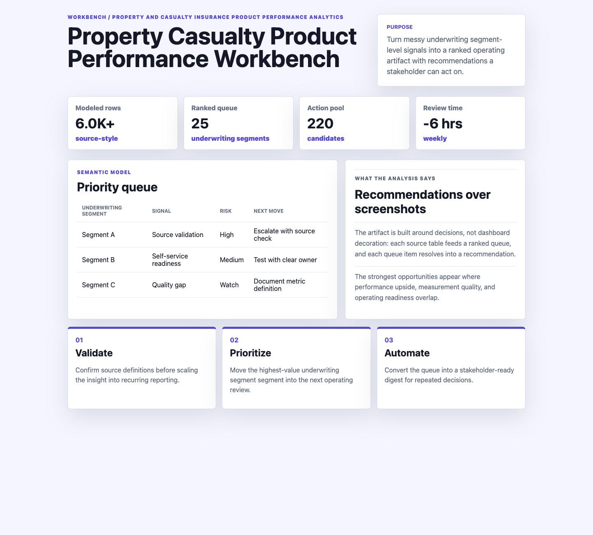

# Property Casualty Product Performance Workbench

I built this because property and casualty insurance product performance analytics needs more than a dashboard: it needs a decision artifact that connects source data, analysis, and next actions.



## What this project is

This project is a workbench for property and casualty insurance product performance analytics. It uses synthetic but workflow-shaped data to rank underwriting segment-level risks and convert the output into stakeholder-ready recommendations.

## Data sources

- `entities.csv` - 36 underwriting segment records
- `daily_metrics.csv` - 5,040 daily operating rows
- `source_events.csv` - 760 event, exception, QA, and stakeholder-request records
- `recommended_actions.csv` - 220 action candidates

## Analysis outputs

- `analysis/executive_findings.md`
- `analysis/analysis_plan.md`
- `analysis/sql_checks.sql`
- `analysis/outputs/priority_queue.csv`

## Recommendation

Use the priority queue to focus stakeholder attention on the underwriting segment segments where performance upside, measurement risk, and operational readiness overlap.

## Run locally

```bash
python3 -m http.server 4173
```
