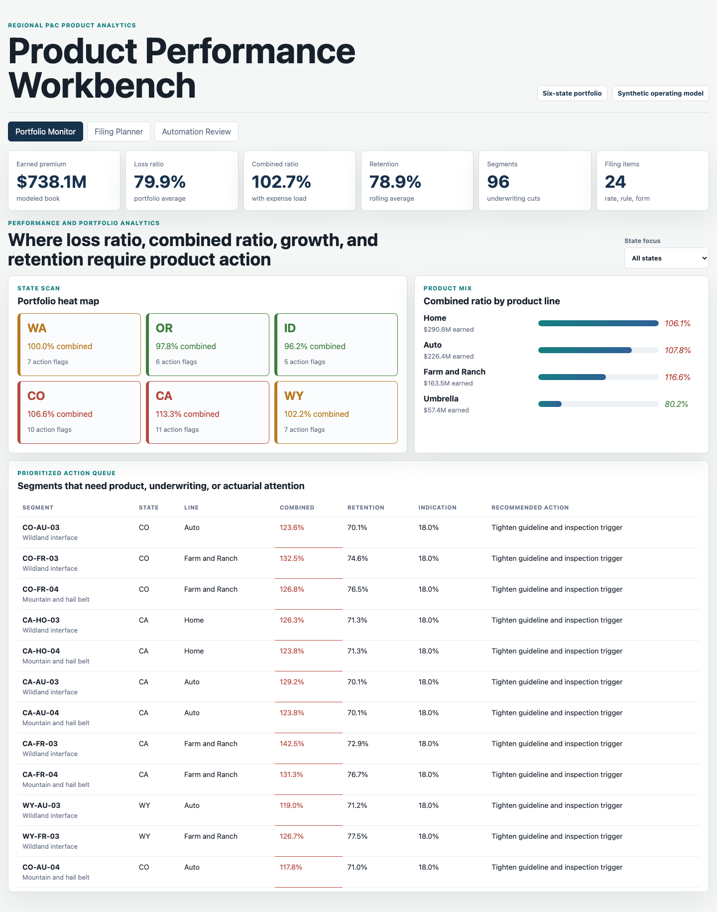
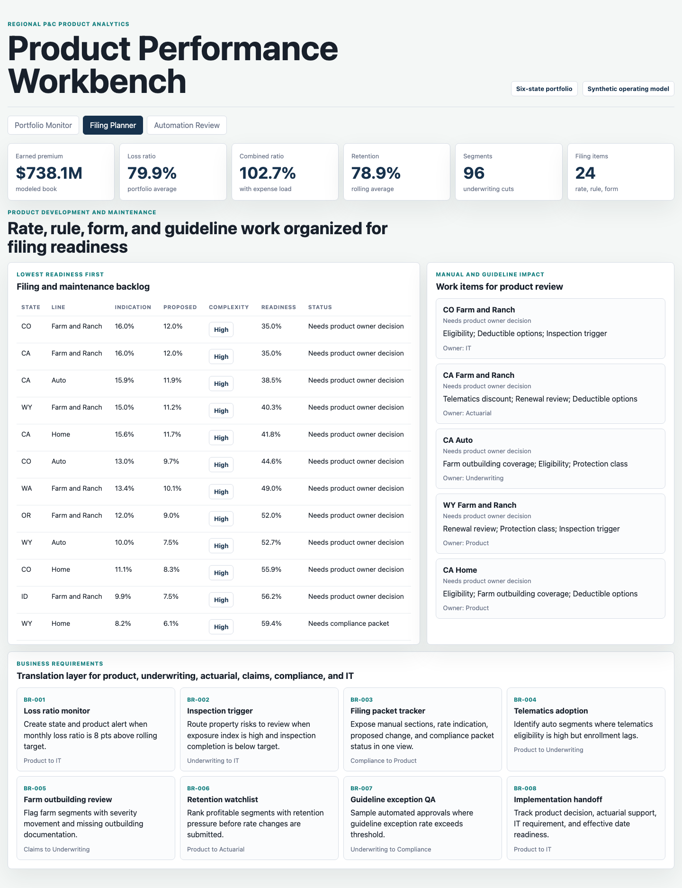
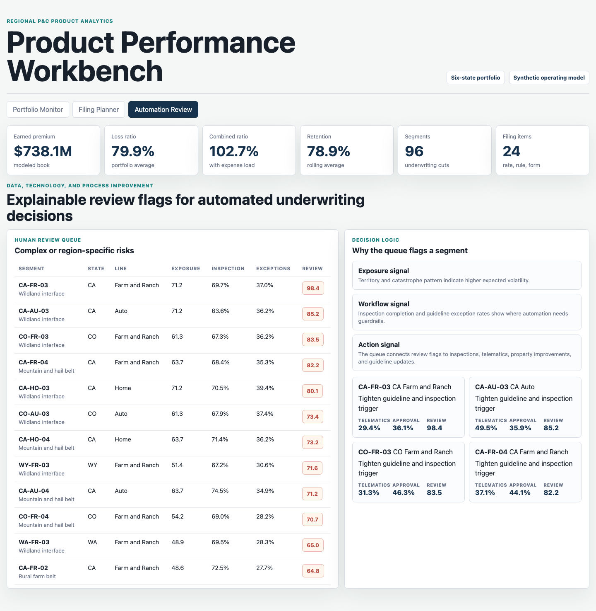

# Property Casualty Product Performance Workbench

This portfolio artifact is a product performance workbench for a regional property and casualty insurance carrier. It shows how a Product Analyst can monitor profitability, support filing and product maintenance work, and flag underwriting automation decisions that need additional review.

The artifact is intentionally built as an operating packet, not only a dashboard. It connects portfolio KPIs, filing readiness, underwriting guideline impacts, and product-to-IT business requirements in one lightweight static app.

## Screenshots



Caption: The Portfolio Monitor summarizes synthetic earned premium, loss ratio, combined ratio, retention, segment count, and filing items. It also highlights state and product-line performance so product, underwriting, and actuarial partners can see where combined ratio and retention pressure require action.



Caption: The Filing Planner ranks rate, rule, form, and underwriting guideline work by readiness. It shows proposed rate change, filing complexity, manual sections impacted, owner, and business requirements that translate product needs into IT and operational delivery work.



Caption: The Automation Review surface flags complex or region-specific underwriting risks. It uses exposure, inspection completion, guideline exception rate, automation approval rate, and telematics eligibility to identify where automated decisioning should receive human review.

## What The Workbench Demonstrates

- Product performance and portfolio analytics across loss ratio, combined ratio, retention, state, product line, territory, and underwriting segment.
- Product development and maintenance thinking through rate indication, proposed rate change, manual sections, rule dependencies, and filing readiness.
- Regulatory and filing support through a prioritized backlog of filing work items.
- Data, technology, and process improvement through business requirements and explainable automation review flags.
- Cross-functional collaboration by connecting Product, Underwriting, Actuarial, Claims, Compliance, and IT work into one decision artifact.

## Data Strategy

All operating data in this repository is synthetic. It is not real carrier performance and should not be read as actual policy, claim, filing, or underwriting data.

The synthetic model is based on common P&C insurance structures:

- Six Western states.
- Four product lines: Home, Auto, Farm and Ranch, and Umbrella.
- Four territory types: urban agency corridor, rural farm belt, wildland interface, and mountain and hail belt.
- Monthly portfolio measures: written premium, earned premium, incurred losses, loss ratio, expense ratio, combined ratio, retention, policy count, claim frequency, and average claim severity.
- Segment-level underwriting signals: exposure index, inspection completion, telematics eligibility, automation approval rate, guideline exception rate, and baseline retention.
- Product maintenance work: rate indication, proposed rate change, filing complexity, readiness score, filing status, impacted manual sections, form or rule dependency, and owner.

The distributions are deterministic from a fixed random seed in `scripts/score_operating_data.py`. Loss ratios are shaped by product base loss cost, state catastrophe load, territory risk load, seasonality, and random operating variation. Retention decreases as exposure pressure rises. Filing readiness decreases when combined ratio pressure, rate indication, and regulatory complexity increase. Automation review scores increase when exposure is high, inspections are incomplete, guideline exceptions are elevated, and automation approval rates are low.

## Repository Structure

- `index.html`: Static app shell with three workbench surfaces.
- `src/app.js`: Renders the portfolio monitor, filing planner, and automation review surfaces from generated data.
- `src/app_data.js`: Generated app data used by the browser.
- `src/styles.css`: Responsive UI styling for the workbench.
- `scripts/score_operating_data.py`: Synthetic data generator and scoring script.
- `data/portfolio_monthly.csv`: Synthetic monthly operating data.
- `data/underwriting_segments.csv`: Synthetic segment metadata and underwriting signals.
- `data/filing_backlog.csv`: Synthetic filing and product maintenance backlog.
- `data/workflow_requirements.csv`: Product-to-IT business requirements.
- `analysis/outputs/product_action_queue.csv`: Ranked product action queue.
- `analysis/outputs/filing_readiness.csv`: Ranked filing readiness queue.
- `analysis/outputs/automation_review_queue.csv`: Ranked underwriting automation review queue.

## Run Locally

```bash
python3 scripts/score_operating_data.py
python3 -m http.server 4173
```

Open `http://localhost:4173`.

If port `4173` is already in use, choose another port:

```bash
python3 -m http.server 4183
```

## Scope

This artifact does:

- Generate a defensible synthetic P&C operating dataset.
- Rank product action, filing readiness, and underwriting automation review priorities.
- Provide three distinct surfaces that support product review discussions.
- Document the assumptions behind the synthetic data.

This artifact does not:

- Use real carrier policy, claims, filing, or underwriting data.
- Claim to predict actual future losses.
- Replace actuarial ratemaking, regulatory filing review, compliance review, or underwriting judgment.
- Connect to a production BI tool, policy administration system, claims platform, or underwriting rules engine.
